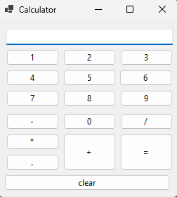
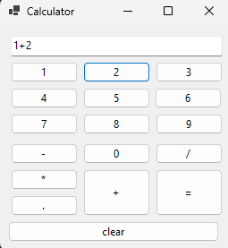
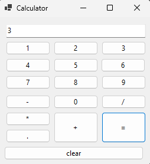

🧮 Calculator

A simple calculator built using C#, WinForms, and .NET Framework 4.8.  
Supports basic arithmetic operations, including addition, ubtraction, multiplication, division, and can handle decimal inputs

---

🚀 Features

- ✅ Basic arithmetic operations
- ✅ Decimal point handling
- ✅ User-friendly GUI

---

🌟 Future Improvements and Features

- Keyboard inputs
- More operation types
- Settings for customizing colors

---

🛠️ Technologies Used

- Language - C#
- IDE - Microsoft Visual Studio 
- GUI Toolkit - Windows Forms
- Framework - .NET Framework 4.8
  
---

🖥️ How to Run

1. Download the Release folder(Calulator\bin\Release).
2. Go to "net9.0-windows" folder.
3. Run Calculator.exe
